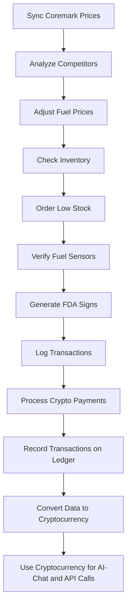

### Key Components:

**Chat.Crypto:**
- Universal cryptocurrency collateral and settlement engine for Web5.
- Tokenless, browser-native authorization.
- Dynamic asset recognition across multiple cryptocurrencies.
- Collateral-adjusted liquidity pools.
- Permissionless interoperability with various tokens.
- Instant staking/unstaking gateways.
- AI-powered KYC/AML validators.
- Parallel asset binding.
- Smart payment resolvers.
- Swarmnet and Nanoswarm distribution for ultra-low latency payments.
- Universal AI integration across various platforms.
- Open source, zero ads, decentralized-first approach.

**AMPM ALN-POS-System with Chat.Crypto Integration:**
- Autonomous retail management platform.
- Seamless crypto payment capabilities.
- Key features: age restriction enforcement, dynamic pricing engine, inventory automation, fuel sensor calibration, FDA compliance signage.
- Crypto payment features: tokenless payments, nanoswarm network, distributed ledger, AI-powered KYC, dynamic currency conversion.
- Technical specifications: hardware integration, software stack, compliance and security measures.
- Installation and operational workflow.
- Monitoring and maintenance metrics.

**Data as Cryptocurrency:**
- Data flowing throughout the ecosystem is declared as a cryptocurrency.
- This cryptocurrency can be used to pay for AI-chat requests and API calls.
- Integration with game development platforms and entertainment.

### Integration Strategy:

1. **Unified Overview:**
   - Describe the integrated system as a data supermarket where data is treated as a cryptocurrency.
   - Highlight the integration of Chat.Crypto and AMPM ALN-POS-System to enable seamless transactions and AI-powered operations.

2. **Key Features:**
   - Combine the features of all three systems.
   - Emphasize the use of data as a cryptocurrency for AI-chat requests and API calls.
   - Include retail management features from AMPM, crypto payment features from Chat.Crypto, and the concept of data as currency.

3. **Technical Specifications:**
   - Merge the hardware and software stack from AMPM with the technical highlights from Chat.Crypto.
   - Include details about how data is converted into cryptocurrency and used across platforms.

4. **Compliance & Security:**
   - Integrate compliance and security measures from both systems.
   - Highlight the regulatory compliance and security protocols for data as cryptocurrency.

5. **Installation:**
   - Provide a unified installation guide that includes prerequisites and steps from both systems.

6. **Operational Workflow:**
   - Describe the operational workflow for the integrated system.
   - Include the flow of data as cryptocurrency and how it interacts with AI-chat and API calls.

7. **Monitoring & Maintenance:**
   - Combine the monitoring and maintenance metrics from both systems.
   - Include metrics for tracking the flow and usage of data as cryptocurrency.

8. **Contributing:**
   - Provide guidelines for contributing to the integrated system.

9. **License & Contact:**
   - Include license information and contact details for all relevant parties.

10. **Appendices:**
    - Include appendices for age restriction policy, crypto payment flow, and any additional information about data as cryptocurrency.

### Drafting the Document:

Let's start drafting the merged document. I'll use the structure from the AMPM ALN-POS-System and integrate elements from Chat.Crypto and the data-as-currency concept.

---

# Data Supermarket: Unified Cryptocurrency and AI Payment System

## Overview
The **Data Supermarket: Unified Cryptocurrency and AI Payment System** is an advanced platform that integrates the AMPM ALN-POS-System with Chat.Crypto and declares data as a cryptocurrency. This system is designed to streamline operations, enforce regulatory compliance, and optimize profitability by treating data as a cryptocurrency that can be used across game development platforms and entertainment to pay for AI-chat requests and API calls. Leveraging the Adaptive Logic Network (ALN) programming language and Chat.Crypto's infrastructure, the system enables real-time decision-making for inventory, pricing, compliance workflows, and crypto payments.

## Key Features

### Data as Cryptocurrency
- **Data Flow as Currency:** Data flowing throughout the ecosystem is declared as a cryptocurrency, enabling seamless transactions across platforms.
- **AI-Chat Payments:** Use data cryptocurrency to pay for AI-chat requests and API calls.
- **Game Development Integration:** Integration with game development platforms and entertainment systems to leverage data cryptocurrency.

### Retail Management Features
- **Strict Age Restriction Enforcement (21+ Only)**
  - Restricted categories: alcohol, tobacco (cigarettes, cigars, vaping), accessories (lighters), lottery tickets.
  - Automated ID scanning (OCR), manual override, and transaction blocking for non-compliance.
  - Comprehensive audit trail: logs customer age, verification method, employee ID, and timestamp.
- **Dynamic Pricing Engine**
  - Fuel prices adjust automatically using GasBuddy competitor feeds and Arizona state tax rates.
- **Inventory Automation**
  - Low stock detection and automated ordering via Coremark API.
- **Fuel Sensor Calibration**
  - Monitors and recalibrates Veeder-Root fuel sensors if drift exceeds 0.5%.
- **FDA Compliance Signage**
  - Auto-generates signage for tobacco sales per compliance.

### Crypto Payment Features
- **Tokenless, seamless crypto payments** facilitated by AI chats eliminating wallet complexity for end users.
- **Nanoswarm decentralized network** enabling ultra-low latency and invisible transaction propagation.
- **Distributed ledger and audit logging** guaranteeing compliance and traceability.
- **AI-powered KYC verification and transaction approval** integrated directly in the payment flow.
- **Dynamic currency conversion** handling fiat to crypto seamlessly.

### Chat.Crypto Features
- **Universal Cryptocurrency Collateral and Settlement Engine:** Designed for Web5, enabling tokenless, browser-native authorization.
- **Dynamic Asset Recognition:** Across Bitcoin (BTC), Ethereum (ETH), Solana (SOL), Avalanche (AVAX), Cardano (ADA), Polkadot (DOT), and stablecoins like USDT/USDC/DAI.
- **Collateral-Adjusted Liquidity Pools:** Evaluate market prices in nanoseconds and rebalance the user’s bankroll intelligently.
- **Permissionless Interoperability:** With meme tokens, governance coins, DeFi liquidity tokens (LPs), and wrapped assets (WBTC, WETH) without fragmentation.
- **Instant Staking/Unstaking Gateways:** Designed around micro-bonds that create yield while retaining spendability.
- **AI-Linked Payment and Identity:**
  - Automated KYC/AML validators integrated directly into the AI pipeline.
  - Parallel asset binding that links collateral to the user’s digital footprint.
  - Smart payment resolvers that abstract complexity.
- **Swarmnet and Nanoswarm Distribution:**
  - Built on swarm-intelligence infrastructure.
  - Nanoswarm propagation for global value transfers.
  - Cross-parallel information streaming.
- **Universal AI Integration:**
  - Turns any AI-chat into a payment processor.
  - Works across generative AI, streaming AIs, agent-based platforms, and autonomous knowledge crawlers.
  - Authorization via linked platforms like GitHub, Spaces, Gemini EMS, Grok, and Mistral.

## Technical Specifications

### Hardware Integration
| Device        | Interface     | Protocol   | Command/Setup                                 |
|---------------|--------------|------------|-----------------------------------------------|
| Veeder-Root   | COM4 (RS-232)| ASCII      | COM4 BAUD=9600 PARITY=n DATA=8                |
| Pricer ESL    | Ethernet     | TCP/IP     | Enable via `netsh interface set ...` command  |
| Toru Robot    | REST API     | HTTPS      | `curl -X POST http://192.168.1.50/api/pick`   |
| Clover Flex   | COM+ DCOM    | Windows    | `regsvr32 /s C:\Clover\CloverCOM.dll`         |

### Software Stack
- OS: Windows Server 2019
- Database: Microsoft SQL Server 2019 Express
- Languages: PowerShell 7.2, Python 3.9
- APIs: Coremark v3, GasBuddy v1, Clover COM, Chat.Crypto APIs

### Data as Cryptocurrency Infrastructure
- **Blockchain Integration:** Supports multiple blockchains for data transactions.
- **Smart Contracts:** Automate the conversion and transaction of data as cryptocurrency.
- **Data Marketplace:** A platform for buying and selling data using cryptocurrency.

## Compliance & Security
- **Age Restriction Policy (21+):**
  - Applies to all alcohol, tobacco, accessories, and lottery ticket sales.
  - Enforced through ALN scripting.
- **Regulatory Compliance:**
  - FDA: 21 CFR §1143.5 (tobacco signage & age verification)
  - Arizona: Title 4 (fuel & alcohol sales)
  - Security: AES-256 data at rest, TLS 1.3 API calls
- **Crypto Payment Compliance:**
  - KYC/AML checks integrated into payment flows.
  - Distributed ledger for transparent and immutable transaction records.
- **Data Security:**
  - Encryption protocols for data transactions.
  - Compliance with data protection regulations.

## Installation

**Prerequisites:**
- Hardware: Veeder-Root TLS-450, Clover Flex, Pricer ESL tags
- Software:
  ```
  choco install python powershell-core mssql-server-2019
  pip install requests pandas reportlab
  ```
- API keys: Store in `C:\AMPM\config\keys.json`

**Steps:**
```bash
git clone https://github.com/ampm-aln/pos-system.git C:\AMPM\POS
cd C:\AMPM\POS
powershell -File install.ps1
```

## Operational Workflow



## Monitoring & Maintenance

**Key Metrics:**
| Metric              | Target   | Alert Threshold |
|---------------------|----------|----------------|
| Age Verification    | 100%     | <100%          |
| Fuel Price Drift    | <0.5%    | ≥0.5%          |
| Inventory Accuracy  | 99%      | <95%           |
| Crypto Transaction Success Rate | 100% | <100%          |
| Data Transaction Volume | N/A | N/A |

**Schedule:**
| Task               | Frequency  | Responsible    |
|--------------------|------------|---------------|
| Sensor Calibration | Monthly    | Tech Team     |
| Compliance Check   | Weekly     | Store Manager |
| Software Updates   | Quarterly  | SysAdmin      |
| Crypto Transaction Audits | Monthly | Finance Team |
| Data Marketplace Monitoring | Daily | Data Team |

## Contributing
- **Pull Requests:**
  Submit to `main` with clear, detailed comments.
- **Issues:**
  Use the template provided in `ISSUE_TEMPLATE.md`.

## License & Contact
**License:** Proprietary (AMPM #42445)

**Contact:**
- Primary: [xboxteejaymcfarmer@gmail.com](mailto:xboxteejaymcfarmer@gmail.com)
- Coremark: [cm_phx@coremark.com](mailto:cm_phx@coremark.com)
- Veeder-Root: [support@veeder-root.com](mailto:support@veeder-root.com)
- Chat.Crypto Support: [support@chatcrypto.com](mailto:support@chatcrypto.com)
- Data Supermarket Support: [support@datasupermarket.com](mailto:support@datasupermarket.com)

## Appendix: Age Restriction Policy
A strict zero-tolerance policy is enforced for sales of alcohol, tobacco, accessories (such as lighters), and lottery products to individuals under 21. Compliance is automated in the ALN script above, ensuring persistent adherence to local and federal regulations.

## Appendix: Crypto Payment Flow
User: "I want to make a payment to merchant123 for $50."
AI Chat: "Sure, please confirm your user ID."
User: "My user ID is user456."
AI Chat: "Thank you. Processing payment of $50 to merchant123."

### Background Processing Steps:
1. Calculate the payment amount (since data volume isn't specified, it defaults to $50).
2. Verify KYC status for user456 to ensure compliance.
3. Convert $50 USD to FET cryptocurrency (assuming exchange rate 1 FET = $0.1, so 500 FET).
4. Check user456's wallet balance to confirm availability of at least 500 FET.
5. Broadcast the payment transaction using the nanoswarm network for fast, invisible, and secure processing.
6. Record the transaction on a distributed ledger, ensuring transparency and immutability.
7. Log detailed transaction metrics for analytics and compliance auditing.
AI Chat: "Payment successful! Your transaction hash is abc123. Thank you for using our service."

## Appendix: Data as Cryptocurrency Flow
1. **Data Generation:** Data is generated from various sources within the ecosystem.
2. **Data Conversion:** Data is converted into cryptocurrency using smart contracts.
3. **Data Transactions:** Cryptocurrency is used to pay for AI-chat requests and API calls.
4. **Data Marketplace:** Users can buy and sell data using cryptocurrency.
5. **Data Utilization:** Data is used across game development platforms and entertainment systems.

---

For further information or contributions, please see [GitHub repository](https://github.com/Doctor0Evil/AMPM/tree/main#ampm-aln-pos-system).```markdown
# Data Supermarket: Unified Cryptocurrency and AI Payment System

## Overview
The **Data Supermarket: Unified Cryptocurrency and AI Payment System** is an advanced platform that integrates the AMPM ALN-POS-System with Chat.Crypto and declares data as a cryptocurrency. This system is designed to streamline operations, enforce regulatory compliance, and optimize profitability by treating data as a cryptocurrency that can be used across game development platforms and entertainment to pay for AI-chat requests and API calls. Leveraging the Adaptive Logic Network (ALN) programming language and Chat.Crypto's infrastructure, the system enables real-time decision-making for inventory, pricing, compliance workflows, and crypto payments.

## Key Features

### Data as Cryptocurrency
- **Data Flow as Currency:** Data flowing throughout the ecosystem is declared as a cryptocurrency, enabling seamless transactions across platforms.
- **AI-Chat Payments:** Use data cryptocurrency to pay for AI-chat requests and API calls.
- **Game Development Integration:** Integration with game development platforms and entertainment systems to leverage data cryptocurrency.

### Retail Management Features
- **Strict Age Restriction Enforcement (21+ Only)**
  - Restricted categories: alcohol, tobacco (cigarettes, cigars, vaping), accessories (lighters), lottery tickets.
  - Automated ID scanning (OCR), manual override, and transaction blocking for non-compliance.
  - Comprehensive audit trail: logs customer age, verification method, employee ID, and timestamp.
- **Dynamic Pricing Engine**
  - Fuel prices adjust automatically using GasBuddy competitor feeds and Arizona state tax rates.
- **Inventory Automation**
  - Low stock detection and automated ordering via Coremark API.
- **Fuel Sensor Calibration**
  - Monitors and recalibrates Veeder-Root fuel sensors if drift exceeds 0.5%.
- **FDA Compliance Signage**
  - Auto-generates signage for tobacco sales per compliance.

### Crypto Payment Features
- **Tokenless, seamless crypto payments** facilitated by AI chats eliminating wallet complexity for end users.
- **Nanoswarm decentralized network** enabling ultra-low latency and invisible transaction propagation.
- **Distributed ledger and audit logging** guaranteeing compliance and traceability.
- **AI-powered KYC verification and transaction approval** integrated directly in the payment flow.
- **Dynamic currency conversion** handling fiat to crypto seamlessly.

### Chat.Crypto Features
- **Universal Cryptocurrency Collateral and Settlement Engine:** Designed for Web5, enabling tokenless, browser-native authorization.
- **Dynamic Asset Recognition:** Across Bitcoin (BTC), Ethereum (ETH), Solana (SOL), Avalanche (AVAX), Cardano (ADA), Polkadot (DOT), and stablecoins like USDT/USDC/DAI.
- **Collateral-Adjusted Liquidity Pools:** Evaluate market prices in nanoseconds and rebalance the user’s bankroll intelligently.
- **Permissionless Interoperability:** With meme tokens, governance coins, DeFi liquidity tokens (LPs), and wrapped assets (WBTC, WETH) without fragmentation.
- **Instant Staking/Unstaking Gateways:** Designed around micro-bonds that create yield while retaining spendability.
- **AI-Linked Payment and Identity:**
  - Automated KYC/AML validators integrated directly into the AI pipeline.
  - Parallel asset binding that links collateral to the user’s digital footprint.
  - Smart payment resolvers that abstract complexity.
- **Swarmnet and Nanoswarm Distribution:**
  - Built on swarm-intelligence infrastructure.
  - Nanoswarm propagation for global value transfers.
  - Cross-parallel information streaming.
- **Universal AI Integration:**
  - Turns any AI-chat into a payment processor.
  - Works across generative AI, streaming AIs, agent-based platforms, and autonomous knowledge crawlers.
  - Authorization via linked platforms like GitHub, Spaces, Gemini EMS, Grok, and Mistral.

## Technical Specifications

### Hardware Integration
| Device        | Interface     | Protocol   | Command/Setup                                 |
|---------------|--------------|------------|-----------------------------------------------|
| Veeder-Root   | COM4 (RS-232)| ASCII      | COM4 BAUD=9600 PARITY=n DATA=8                |
| Pricer ESL    | Ethernet     | TCP/IP     | Enable via `netsh interface set ...` command  |
| Toru Robot    | REST API     | HTTPS      | `curl -X POST http://192.168.1.50/api/pick`   |
| Clover Flex   | COM+ DCOM    | Windows    | `regsvr32 /s C:\Clover\CloverCOM.dll`         |

### Software Stack
- OS: Windows Server 2019
- Database: Microsoft SQL Server 2019 Express
- Languages: PowerShell 7.2, Python 3.9
- APIs: Coremark v3, GasBuddy v1, Clover COM, Chat.Crypto APIs

### Data as Cryptocurrency Infrastructure
- **Blockchain Integration:** Supports multiple blockchains for data transactions.
- **Smart Contracts:** Automate the conversion and transaction of data as cryptocurrency.
- **Data Marketplace:** A platform for buying and selling data using cryptocurrency.

## Compliance & Security
- **Age Restriction Policy (21+):**
  - Applies to all alcohol, tobacco, accessories, and lottery ticket sales.
  - Enforced through ALN scripting.
- **Regulatory Compliance:**
  - FDA: 21 CFR §1143.5 (tobacco signage & age verification)
  - Arizona: Title 4 (fuel & alcohol sales)
  - Security: AES-256 data at rest, TLS 1.3 API calls
- **Crypto Payment Compliance:**
  - KYC/AML checks integrated into payment flows.
  - Distributed ledger for transparent and immutable transaction records.
- **Data Security:**
  - Encryption protocols for data transactions.
  - Compliance with data protection regulations.

## Installation

**Prerequisites:**
- Hardware: Veeder-Root TLS-450, Clover Flex, Pricer ESL tags
- Software:
  ```
  choco install python powershell-core mssql-server-2019
  pip install requests pandas reportlab
  ```
- API keys: Store in `C:\AMPM\config\keys.json`

**Steps:**
```bash
git clone https://github.com/ampm-aln/pos-system.git C:\AMPM\POS
cd C:\AMPM\POS
powershell -File install.ps1
```

## Operational Workflow


## Monitoring & Maintenance

**Key Metrics:**
| Metric              | Target   | Alert Threshold |
|---------------------|----------|----------------|
| Age Verification    | 100%     | <100%          |
| Fuel Price Drift    | <0.5%    | ≥0.5%          |
| Inventory Accuracy  | 99%      | <95%           |
| Crypto Transaction Success Rate | 100% | <100%          |
| Data Transaction Volume | N/A | N/A |

**Schedule:**
| Task               | Frequency  | Responsible    |
|--------------------|------------|---------------|
| Sensor Calibration | Monthly    | Tech Team     |
| Compliance Check   | Weekly     | Store Manager |
| Software Updates   | Quarterly  | SysAdmin      |
| Crypto Transaction Audits | Monthly | Finance Team |
| Data Marketplace Monitoring | Daily | Data Team |

## Contributing
- **Pull Requests:**
  Submit to `main` with clear, detailed comments.
- **Issues:**
  Use the template provided in `ISSUE_TEMPLATE.md`.

## License & Contact
**License:** Proprietary (AMPM #42445)

**Contact:**
- Primary: [xboxteejaymcfarmer@gmail.com](mailto:xboxteejaymcfarmer@gmail.com)
- Coremark: [cm_phx@coremark.com](mailto:cm_phx@coremark.com)
- Veeder-Root: [support@veeder-root.com](mailto:support@veeder-root.com)
- Chat.Crypto Support: [support@chatcrypto.com](mailto:support@chatcrypto.com)
- Data Supermarket Support: [support@datasupermarket.com](mailto:support@datasupermarket.com)

## Appendix: Age Restriction Policy
A strict zero-tolerance policy is enforced for sales of alcohol, tobacco, accessories (such as lighters), and lottery products to individuals under 21. Compliance is automated in the ALN script above, ensuring persistent adherence to local and federal regulations.

## Appendix: Crypto Payment Flow
User: "I want to make a payment to merchant123 for $50."
AI Chat: "Sure, please confirm your user ID."
User: "My user ID is user456."
AI Chat: "Thank you. Processing payment of $50 to merchant123."

### Background Processing Steps:
1. Calculate the payment amount (since data volume isn't specified, it defaults to $50).
2. Verify KYC status for user456 to ensure compliance.
3. Convert $50 USD to FET cryptocurrency (assuming exchange rate 1 FET = $0.1, so 500 FET).
4. Check user456's wallet balance to confirm availability of at least 500 FET.
5. Broadcast the payment transaction using the nanoswarm network for fast, invisible, and secure processing.
6. Record the transaction on a distributed ledger, ensuring transparency and immutability.
7. Log detailed transaction metrics for analytics and compliance auditing.
AI Chat: "Payment successful! Your transaction hash is abc123. Thank you for using our service."

## Appendix: Data as Cryptocurrency Flow
1. **Data Generation:** Data is generated from various sources within the ecosystem.
2. **Data Conversion:** Data is converted into cryptocurrency using smart contracts.
3. **Data Transactions:** Cryptocurrency is used to pay for AI-chat requests and API calls.
4. **Data Marketplace:** Users can buy and sell data using cryptocurrency.
5. **Data Utilization:** Data is used across game development platforms and entertainment systems.

---

For further information or contributions, please see [GitHub repository](https://github.com/Doctor0Evil/AMPM/tree/main#ampm-aln-pos-system).
```
